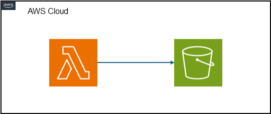

# AWS Lambda to AWS S3

This SAM template creates a Lambda function that writes to an S3 bucket when invoked.

## Lab Overview And High Level Design

Let's start with the High Level Design.



## Deployment Instructions if you want to clone and play

1. Create a new directory, navigate to that directory in a terminal and clone the GitHub repository:
    ``` 
    git clone https://github.com/ypmkumar1/lambda-s3.git
    ```
1. Change directory to the pattern directory:
    ```
    cd lambda-s3
    ```
1. From the command line, use AWS SAM to deploy the AWS resources for the pattern as specified in the template.yml file:
    ```
    sam deploy --guided
    ```
1. During the prompts:
    * Enter a stack name
    * Enter the desired AWS Region
    * Allow SAM CLI to create IAM roles with the required permissions.

    Once you have run `sam deploy --guided` mode once and saved arguments to a configuration file (samconfig.toml), you can use `sam deploy` in future to use these defaults.

1. Note the outputs from the SAM deployment process. These contain the resource names and/or ARNs which are used for testing.

## How it works

This SAM template creates a Lambda function that writes to an S3 bucket when invoked. Once you run `sam deploy --guided`, you will enter the name of the destination bucket for the objects to be stored.

## Testing

You can test the solution by accessing the Lambda console, finding your Lambda function, and clicking `Test` in the Code Source section. You can also invoke the function from the CLI using `aws lambda invoke --function-name ENTER_FUNCTION_NAME output.txt`. Then, go to the S3 console and ensure your object has been written to the bucket you specified.

## Cleanup
 
1. Delete the stack
    ```bash
    aws cloudformation delete-stack --stack-name STACK_NAME
    ```
1. Confirm the stack has been deleted
    ```bash
    aws cloudformation list-stacks --query "StackSummaries[?contains(StackName,'STACK_NAME')].StackStatus"
    ```
